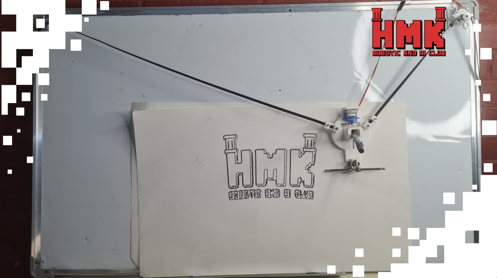

# 🎨 Drawing Robot

## 📅 Project Timeline & Context

- **Event:** FMEE 2025 – **AI & Robotics Club** Open Day
- **Date:** November 10–11–12, 2025

---

## 💡 Project Overview

The **Drawing Robot** transforms digital images into **real drawings** on a flat surface using a **polar coordinate system**.  
Two stepper motors move the stylus with high precision, enabling the automated creation of various shapes, patterns, and artistic images.

The robot uses **digital image input** to generate precise drawing commands.  
Through its **polar coordinate system**, the robot translates the commands into **controlled movements of the stylus**, producing accurate and automated artwork on a canvas or paper.  

The project demonstrates the intersection of **technology and creativity**, making robotics accessible for artistic applications.

---

## ⚙️ Components and Parts Used
- 🧠 **Arduino Uno** – main controller for motors and stylus  
- 🔄 **Two Stepper Motors** – precise movement along X and Y axes  
- 🔌 **Motor Driver Circuits** – control and power stepper motors  
- ✏️ **Drawing Stylus** – executes the physical drawing  

---

## 💻 Software and Tools Used
- 🔧 **Arduino IDE** – for programming the microcontroller  
- 🖥️ **Processing** – converts digital images into drawing commands and controls robot motion  

---

## 👨‍💻 Contributors:
Special thanks to :
- **Sulaiman Sulaiman** [LinkedIn](https://www.linkedin.com/in/sulaiman-sulaiman-98355238a)  

---

## 🚀 Future Improvements
- Support for higher resolution images and finer stylus control  
- Integration with AI to create generative art  
- Real-time monitoring and adjustment of drawing parameters  

---

## 📸 Demo

**Coming soon!**

---

**Made with ❤️ using Arduino and Processing.**
